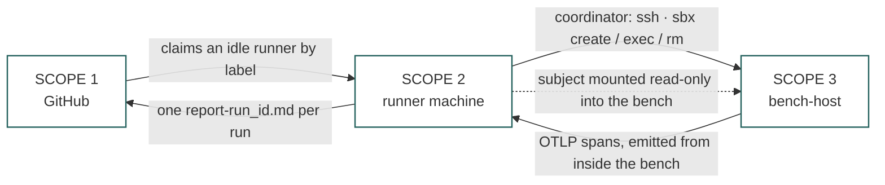
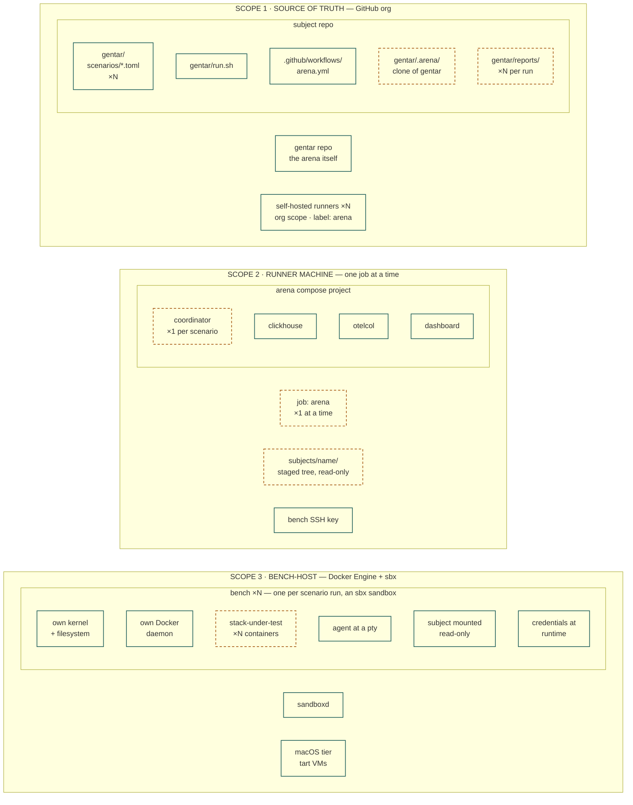
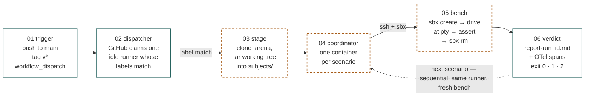
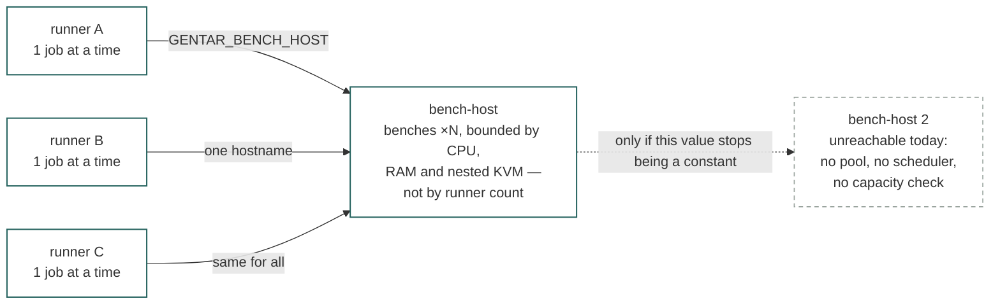

# Scope map

What contains what in a gentar arena, and how many of each.

The system spans **three machines and two lifetimes**: things that persist between
runs, and things that are created and destroyed inside one. Almost every confusion
about gentar comes from mixing those two up — asking which bench a runner *is*, or
expecting a second runner to give you a second bench.

There is a rendered version of this page at [`scope-map.html`](./scope-map.html) —
same content, hand-drawn figures, open it in a browser from a checkout.

> **Conventions used below.** Nesting means containment: an inner thing lives inside
> the outer one and cannot outlive it. Cardinality is written `1 → N` and read as
> *one of the left relates to this many of the right*.

---

## 1. The containment map

Three scopes. The subject repo carries the scenarios but never the arena; the runner
carries the engine but never a bench; the bench-host carries the benches but never
the report.

### The three scopes, and how they touch

Four edges, and only four. GitHub hands a job to a runner; the runner's coordinator
reaches the bench-host over SSH; spans come back from inside the bench; the report
lands in the subject repo. Everything else is containment.

### What lives inside each scope

**Teal solid** survives between runs. **Amber dashed** is created and destroyed inside
one run — the staged subject, the coordinator container, the arena checkout and every
bench are all gone by the time the job ends. Only the report and the spans outlive it.

### The three scopes

**Source of truth — GitHub.** The `gentar` repo is the arena itself; it is never
vendored into a subject. A subject repo contributes a `gentar/` directory holding its
own scenarios, its own `run.sh`, and a workflow. At run time `run.sh` clones gentar
into `gentar/.arena/`, which is gitignored — so the arena version is a run-time
choice (`GENTAR_REF`), not a committed dependency. Runners are registered here too;
registering one at **org scope** means every repo in the org can schedule onto it.

**Runner machine.** A GitHub Actions self-hosted runner is a long-lived worker
process. It polls, claims one job, runs it, goes back to polling. Inside a job it
stages the working tree — uncommitted changes included — as the *subject*, then brings
up the arena compose project: coordinator, ClickHouse, otelcol, and a dashboard
generator that runs on demand. Benches are **not** compose services and never appear
here.

**Bench-host.** A VM or LXC with Docker Engine and `sbx`, logged in once. The
coordinator reaches it over SSH and drives `sbx create` / `exec` / `rm`. Each bench is
an sbx sandbox — its own microVM with its own kernel and its own Docker daemon, so the
nested boundary for a stack-under-test comes free and cannot touch the host's daemon.
The macOS tier is tart VMs on a Mac behind a `[gentar, macos]` runner, because sbx
cannot host macOS sandboxes.

---

## 2. What happens on one push

The same six stations run whether you type `gentar/run.sh` locally or push to `main`.
Only station 2 differs — locally, you are the dispatcher.

One job walks stations 3 through 6 **once per scenario**. The bench is rebuilt every
lap. That is the reset, and it is why a wedged run is discarded rather than repaired.

The exit code is the whole CI contract: `0` pass, `1` fail, `2` usage or config
refusal. A failing run writes a report stating every step with its output, what was
asserted against what it actually saw, and the reproduce command — the artifact is
meant to be handed straight to an agent.

---

## 3. Every relation, counted

### Structural — repository and GitHub scope

| From | Cardinality | To | Note |
|---|---|---|---|
| gentar repo | `1 → N` | arena checkouts | one `.arena/` clone per subject repo, gitignored |
| subject repo | `1 → 1` | `gentar/` directory | the repo contributes its own arena config |
| subject repo | `1 → N` | scenarios | one TOML per suite |
| workflow | `1 → N` | jobs | typically one job, `arena` |
| GitHub org | `1 → N` | runners | an org-scoped runner is reachable by every repo in the org |
| ultimagent constellation | `1 → N` | subjects | components migrate from agent-gauntlet when their owners choose |

### Execution — the relations that decide throughput

| From | Cardinality | To | Note |
|---|---|---|---|
| runner | `1 → 1` | job, at any instant | exclusive. A second job queues until the runner frees up |
| runner | `1 → N` | jobs over time | long-lived worker process, **not** per-run |
| job | `1 → N` | scenarios | `run.sh` loops every suite sequentially inside one job |
| job | `1 → 1` | arena compose project | named `arena-<repo>` |
| scenario run | `1 → 1` | coordinator container | `docker compose run --rm`, one per scenario |
| scenario run | `1 → 1` | bench | the container is the reset |
| scenario run | `1 → 1` | report + verdict | `report-<run_id>.md`; exit `0` pass, `1` fail, `2` refusal |
| coordinator | `N → 1` | bench-host | **the bottleneck.** `GENTAR_BENCH_HOST` is one static hostname in `.env` |
| bench-host | `1 → N` | benches | concurrent, bounded by CPU, RAM and nested KVM |
| runners | `N → M` | bench-hosts | possible in principle; today `N → 1`, because the hostname is a constant |

### Inside one bench, and underneath it

| From | Cardinality | To | Note |
|---|---|---|---|
| bench | `1 → 1` | microVM | an sbx sandbox: own kernel, own filesystem |
| bench | `1 → 1` | Docker daemon | its own — the nested boundary comes free |
| bench Docker daemon | `1 → N` | stack-under-test containers | the agent gets root over a throwaway daemon |
| bench | `1 → 1` | agent | driven at a pty, like a human at a terminal |
| bench | `1 → 1` | subject | mounted read-only, never baked into an image |
| bench | `1 → N` | OTel spans | emitted from inside, joined to assertions in one SQL query |
| Proxmox host | `1 → N` | VMs and LXCs | a bench-host is one guest among many |
| bench-host | `1 → 1` | VM or LXC | a role a machine plays, not a machine type |

The three worth memorising, because they are the ones people get backwards:

1. **A runner is not per-run.** It is a long-lived worker that happens to be running
   your job right now.
2. **A job is not per-scenario.** One job loops every suite sequentially.
3. **Runners do not multiply bench capacity.** See below.

---

## 4. The one edge that limits you

Ten runners would still send every bench to the same box. **Benches are the unit of
work; runners are the unit of queueing.** They scale on different axes and are
configured in different files — the runner count in GitHub, the bench-host in `.env`.
The thing to change for real parallelism is the config value, not the runner count.

### Why collapsing runner and bench-host onto one machine eventually hurts

It works, and for a spike it is the right call. But the two roles size differently:

| | Runner | Bench-host |
|---|---|---|
| What it is | a CI worker slot | a capacity pool for benches |
| Sized by | how many jobs you want in parallel | how many benches run at once |
| Needs | GitHub reach; holds `BENCH_SSH_KEY` | nested KVM, CPU, RAM, disk |
| Weight | tiny | heavy |

Buying one more CI lane by cloning a heavy nested-virt machine is the wrong trade —
and it would not buy any more benches anyway.

---

## 5. The words, fixed

These come from gentar's own design, not from this page. Coining a new name for any of
them collides with something already in the tree.

| Term | Means | Do not confuse with |
|---|---|---|
| **arena** | gentar itself — the harness. *aGENT ARena* | the bench. `.arena/`, `arena.yml` and the `arena` runner label already use this word |
| **bench** | the disposable machine one scenario runs in | the bench-host, which outlives every bench it makes |
| **bench-host** | the box running sbx that hands benches out | the runner, which runs the engine and never hosts a bench |
| **subject** | the component under test — mounted, never baked | the repo. The subject is a staged copy of the working tree, uncommitted changes included |
| **scenario** | a TOML stating *decisions*, not steps | a script. The driver renders decisions into the instruction an agent executes |
| **verdict** | pass or fail read from reality — files, processes, SQL, spans, TTY | the agent's self-report, which is evidence, not a verdict |
| **runner** | a long-lived GitHub worker that claims one job at a time | a dispatcher. GitHub dispatches; the runner obeys |

---

## Appendix — a reference deployment

A worked example of the mapping, not a spec. **Snapshot dated 2026-08-19; expect it to
rot.** The point is to show which role each machine plays, not to pin any hostname.

| Role | Machine | Detail |
|---|---|---|
| arena source | `agent-realm/gentar` | cloned per run into `.arena/` |
| subject | `claude-playbooks` | two scenarios: `cli-head-build`, `cli-release-install` |
| runner | a Proxmox guest | org-scoped, label `arena` |
| bench-host | a second Proxmox guest | 8 cores / 32 GB / 2 TB, Docker CE + sbx 0.38.0, nested KVM verified |
| macOS tier | a Mac running tart | label `[gentar, macos]` |
| telemetry | inside the arena compose project | ClickHouse + otelcol, spans schema ported from agent-gauntlet |

Two things this deployment got wrong, worth checking in yours:

- **`cpu=host` is mandatory on a virtualised bench-host.** An sbx sandbox has its own
  kernel, so the bench-host needs nested virt. Confirm `/dev/kvm` exists inside the
  guest before believing a bench-host works.
- **The bench destroy contract can leak.** A sandbox from a previous run was still
  listed as running, with its workspace left in `/tmp/gentar-workspaces`, despite the
  `trap cleanup EXIT INT TERM` in the lifecycle recipe. "The container is the reset"
  only holds if the destroy is genuinely unconditional — worth asserting on.

---

Sources: this repo's `README.md`, `docs/design.md` and `docker-compose.yml`; a subject
repo's `gentar/run.sh` and `.github/workflows/arena.yml`; run reports; and the `sbx`
disposable-test-bench reference.
