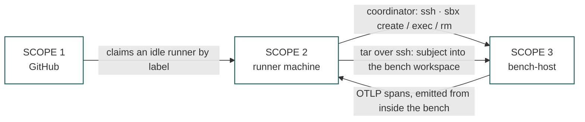
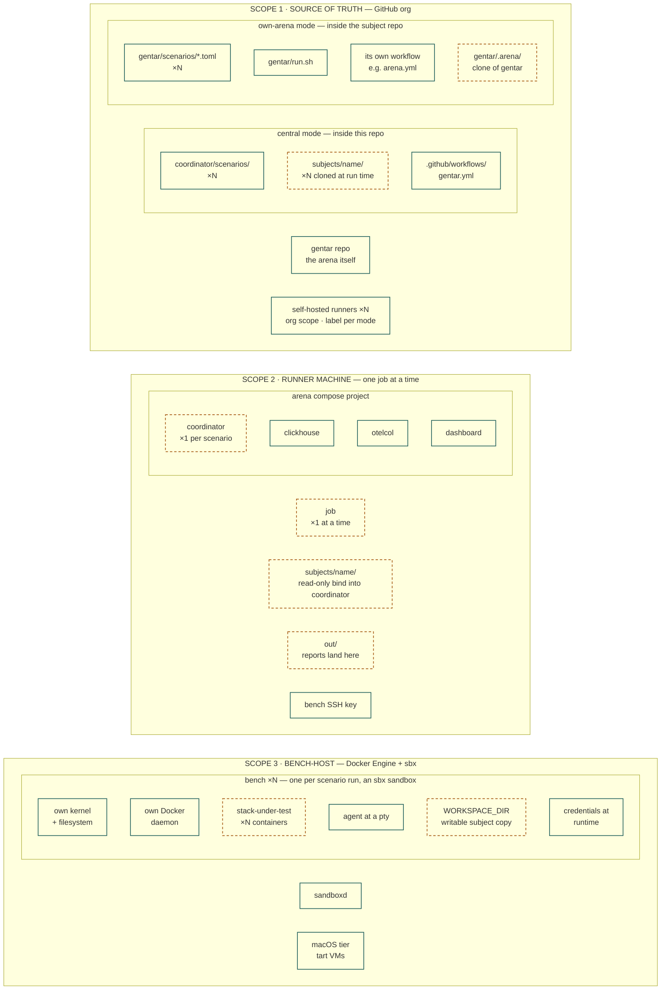
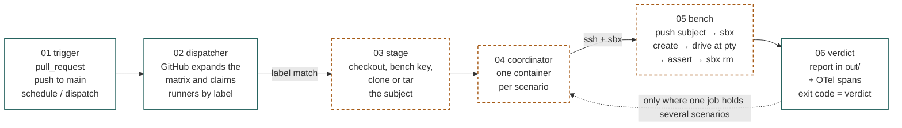
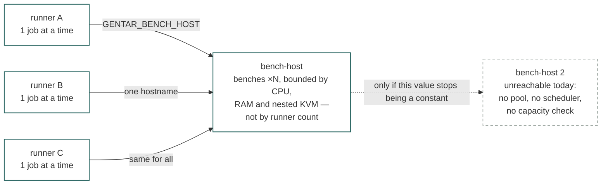

# Scope map

What contains what in a gentar arena, and how many of each.

The system spans **three machines and two lifetimes**: things that persist between
runs, and things that are created and destroyed inside one. Almost every confusion
about gentar comes from mixing those two up — asking which bench a runner *is*, or
expecting a second runner to give you a second bench.

There is a rendered version of this page at [`scope-map.html`](./scope-map.html) —
same content, hand-drawn figures, open it in a browser from a checkout.

First drawn 2026-08-19, against the engine as it then was; refreshed at **0.1.1** for
the four bench backends and the teardown guarantee. The structure and the cardinalities
did not change — that is the point of writing them down.

> **Conventions used below.** Nesting means containment: an inner thing lives inside
> the outer one and cannot outlive it. Cardinality is written `1 → N` and read as
> *one of the left relates to this many of the right*.

---

## 0. First: which mode are you in?

Several cardinalities below differ by integration mode, so settle this first. The two
modes are defined in [`subject-integration.md`](./subject-integration.md) and a repo may
use either or both.

| | **Central arena** | **Own arena** |
|---|---|---|
| Who runs the stack | this repo's CI | the subject repo's CI |
| Where scenarios live | `coordinator/scenarios/` here | `gentar/scenarios/` in the subject |
| How the subject arrives | cloned into this arena's `subjects/` | tarred from the working tree by `gentar/run.sh` |
| Workflow | [`.github/workflows/gentar.yml`](../.github/workflows/gentar.yml) | the subject's own, e.g. `arena.yml` |
| Runner label | `gentar-bench` | the subject's choice, e.g. `arena` |
| Reference example | `kommander-playbook`, `memhouse` | `claude-playbooks` |

**A subject repo does not have to contain a `gentar/` directory.** In central mode it
contains no arena config at all; its scenarios are contributed here by PR. Where a claim
below holds for only one mode, it says so.

---

## 1. The containment map

Three scopes. The subject carries the scenarios but never the arena; the runner carries
the engine but never a bench; the bench-host carries the benches but never the report.

### The three scopes, and how they touch

Note what is **not** drawn: an edge from the runner back to GitHub. Reports are written
into `out/` on the runner through a bind mount. Nothing in
[`gentar.yml`](../.github/workflows/gentar.yml) uploads, commits or otherwise returns
them — they live in the runner's workspace and a later checkout may clean them away.
An own-arena repo can add that edge itself (the reference subject copies reports into
its gitignored `gentar/reports/` and uploads them with `actions/upload-artifact`), but
it is not part of the arena.

### What lives inside each scope

**Teal solid** survives between runs. **Amber dashed** is created and destroyed inside
one run — the cloned or staged subject, the coordinator container, the arena checkout
and every bench are gone by the time the job ends. Only the report on disk and the
spans in ClickHouse outlive it.

### The three scopes in prose

**Source of truth — GitHub.** The `gentar` repo is the arena itself; it is never
vendored into a subject. In central mode the scenarios and the subject clones live
here. In own-arena mode the subject repo contributes its own `gentar/` directory, and
`run.sh` clones gentar into the gitignored `gentar/.arena/` at run time — so the arena
version is a run-time choice (`GENTAR_REF`), not a committed dependency.

**Runner machine.** A GitHub Actions self-hosted runner is a long-lived worker process.
It polls, claims one job, runs it, goes back to polling. Inside a job it brings up the
arena compose project — coordinator, ClickHouse, otelcol, and a dashboard generator that
runs on demand — with `subjects/` bind-mounted **read-only** into the coordinator.
Benches are **not** compose services and never appear here.

**Bench-host.** A VM or LXC with Docker Engine and `sbx`, logged in once. The
coordinator tars the subject over SSH into `/tmp/gentar-workspaces/<run-id>`, then runs
`sbx create <agent> <workspace>`. Each bench is an sbx sandbox — its own microVM with
its own kernel and its own Docker daemon, so the nested boundary for a stack-under-test
comes free and cannot touch the host's daemon. The macOS tier is tart VMs on a Mac
behind a `[gentar, macos]` runner, because sbx cannot host macOS sandboxes.

**Four backends, not two** (added in 0.1.0, after this map was first drawn). A scenario
picks one with `bench = "…"`; the cardinalities above are per bench and hold for all of
them, but what sits at the bench-host end differs:

| tier | what a bench is | what the "bench-host" is |
|---|---|---|
| `sbx` (default) | a microVM: own kernel, own Docker daemon | a Linux box running `sbx` |
| `tart` | a macOS VM cloned from a template | a Mac running the `tart` CLI |
| `osb` | a Linux container | an OpenSandbox server (no SSH; exec and pty go through its daemon) |
| `daytona` | a Linux cloud sandbox | Daytona's ssh gateway — no infrastructure of your own |

The `1 → 1` between a scenario run and a bench is the same in every tier. What changes
is who mints the bench and how the coordinator reaches it.

> **The subject copy inside the bench is writable.** Only the coordinator-side
> `/subjects` bind carries `:ro`. `push_dir()` extracts a *copy* into the bench
> workspace and `sbx create` mounts it with no read-only flag — scenarios such as
> `cli-head-build` deliberately build inside `$WORKSPACE_DIR`. "Mounted, never baked"
> is a statement about provenance, not about write protection. Isolation comes from the
> bench being discarded, not from the mount.

---

## 2. What happens on one push

The loop back to station 4 is **dashed because it is conditional**, and this is the
detail most worth getting right:

| Tier | Jobs | Scenarios per job |
|---|---|---|
| `gate` — every PR and push to main | **6**, a matrix over `smoke`, `bench-template-verify`, `otlp-selfreport`, `budget-sim`, `scripted-onboarding`, `scripted-danger` | exactly **1** |
| `nightly` — schedule, or dispatch with `scenario: nightly` | 1 | **N**, looped sequentially |
| `dispatch` — manual | 1 | exactly **1** |
| own arena — `gentar/run.sh a b c` | 1 | **N**, looped sequentially |

So on the primary CI tier a job runs exactly one scenario, and the fan-out is the
matrix. The bench is still rebuilt for every scenario either way — that is the reset,
and it is why a wedged run is discarded rather than repaired.

**The matrix does not buy parallelism on its own.** All six gate jobs request the same
`[self-hosted, gentar-bench]` label, so with one runner they queue and run one after
another. On top of that, `gentar.yml` sets `concurrency: gentar-<ref>` with
`cancel-in-progress`, deliberately: the bench-host is a single VM and two compose stacks
spawning sandboxes there would race on names.

The exit code is the whole CI contract: `0` pass, `1` fail, `2` usage or config
refusal. A failing run writes a report stating every step with its output, what was
asserted against what it actually saw, and the reproduce command — meant to be handed
straight to an agent.

---

## 3. Every relation, counted

### Structural — repository and GitHub scope

| From | Cardinality | To | Note |
|---|---|---|---|
| gentar repo | `1 → N` | arena checkouts | own-arena only: one `.arena/` clone per subject repo, gitignored |
| subject repo | `0 → 1` | `gentar/` directory | **optional.** Present in own-arena mode; absent in central mode, where scenarios are contributed to `coordinator/scenarios/` by PR |
| central arena | `1 → N` | scenarios | `coordinator/scenarios/` |
| central arena | `1 → N` | subject checkouts | cloned into `subjects/` at run time, token-gated |
| subject repo (own arena) | `1 → N` | scenarios | one TOML per suite in `gentar/scenarios/` |
| workflow | `1 → N` | jobs | `gentar.yml` defines three: `gate`, `nightly`, `dispatch` |
| matrix | `1 → N` | jobs | `gate` expands to 6 jobs, one per scenario |
| GitHub org | `1 → N` | runners | an org-scoped runner is reachable by every repo in the org |
| ultimagent constellation | `1 → N` | subjects | components migrate from agent-gauntlet when their owners choose |

### Execution — the relations that decide throughput

| From | Cardinality | To | Note |
|---|---|---|---|
| runner | `1 → 1` | job, at any instant | exclusive. A second job queues until the runner frees up |
| runner | `1 → N` | jobs over time | long-lived worker process, **not** per-run |
| `gate` job | `1 → 1` | scenario | one `coordinator run "$SCENARIO"` per matrix leg |
| `nightly` job | `1 → N` | scenarios | looped sequentially in one job |
| `run.sh` invocation | `1 → N` | scenarios | own-arena: looped sequentially in one job |
| ref | `1 → 1` | concurrent arena | `concurrency: gentar-<ref>`, `cancel-in-progress` |
| job | `1 → 1` | arena compose project | `COMPOSE_PROJECT_NAME` per tier |
| scenario run | `1 → 1` | coordinator container | `docker compose run --rm`, one per scenario. Since 0.1.0 `bin/arena` starts the supporting services the same way (`run -d --rm`), so every arena container is `AutoRemove`, not just this one |
| scenario run | `1 → 1` | bench | the container is the reset |
| scenario run | `1 → 1` | report + verdict | `report-<run_id>.md` in `out/`; exit `0` pass, `1` fail, `2` refusal |
| coordinator | `N → 1` | bench-host | **the bottleneck.** `GENTAR_BENCH_HOST` is one static hostname |
| bench-host | `1 → N` | benches | concurrent, bounded by CPU, RAM and nested KVM |
| runners | `N → M` | bench-hosts | possible in principle; today `N → 1`, because the hostname is a constant |

### Inside one bench, and underneath it

| From | Cardinality | To | Note |
|---|---|---|---|
| bench | `1 → 1` | microVM | an sbx sandbox: own kernel, own filesystem |
| bench | `1 → 1` | Docker daemon | its own — the nested boundary comes free |
| bench Docker daemon | `1 → N` | stack-under-test containers | the agent gets root over a throwaway daemon |
| bench | `1 → 1` | agent | driven at a pty, like a human at a terminal |
| bench | `1 → 1` | `WORKSPACE_DIR` | a **writable** copy of the subject, pushed by tar over SSH |
| coordinator | `1 → 1` | `/subjects` bind | **read-only** — this is the mount that carries `:ro`, not the bench's |
| bench | `1 → N` | OTel spans | emitted from inside, joined to assertions in one SQL query |
| Proxmox host | `1 → N` | VMs and LXCs | a bench-host is one guest among many |
| bench-host | `1 → 1` | VM or LXC | a role a machine plays, not a machine type |

### The three worth memorising

1. **A runner is not per-run.** It is a long-lived worker that happens to be running
   your job right now.
2. **Job-to-scenario is mode-dependent** — `1 → 1` on the gate matrix, `1 → N` in
   nightly and in `run.sh`. Never assume one from the other.
3. **Runners do not multiply bench capacity.** See below.

---

## 4. The one edge that limits you

Ten runners would still send every bench to the same box. **Benches are the unit of
work; runners are the unit of queueing.** They scale on different axes and live in
different files — the runner count in GitHub, the bench-host in `.env`. For real
parallelism the thing to change is the config value, not the runner count — and today
the `concurrency` group deliberately holds it to one arena per ref anyway.

### Why collapsing runner and bench-host onto one machine eventually hurts

Today they are deliberately the same VM, and the header comment in `gentar.yml` says so:
Docker, sbx and the compose stack in one place, with the coordinator SSHing to itself.
For a single-arena setup that is the right call. The two roles still size differently:

| | Runner | Bench-host |
|---|---|---|
| What it is | a CI worker slot | a capacity pool for benches |
| Sized by | how many jobs you want in parallel | how many benches run at once |
| Needs | GitHub reach; holds `GENTAR_BENCH_KEY` | nested KVM, CPU, RAM, disk |
| Weight | tiny | heavy |

Buying one more CI lane by cloning a heavy nested-virt machine is the wrong trade — and
it would not buy any more benches anyway.

---

## 5. The words, fixed

These come from gentar's own design, not from this page. Coining a new name for any of
them collides with something already in the tree.

| Term | Means | Do not confuse with |
|---|---|---|
| **arena** | gentar itself — the harness. *aGENT ARena* | the bench. `.arena/` and the own-arena `arena` runner label already use this word |
| **bench** | the disposable machine one scenario runs in | the bench-host, which outlives every bench it makes |
| **bench-host** | the box running sbx that hands benches out | the runner, which runs the engine and never hosts a bench — even when both are the same VM |
| **subject** | the component under test — mounted, never baked | the repo. The subject is a copy: cloned into `subjects/`, or tarred from a working tree |
| **scenario** | a TOML stating *decisions*, not steps | a script. The driver renders decisions into the instruction an agent executes |
| **verdict** | pass or fail read from reality — files, processes, SQL, spans, TTY | the agent's self-report, which is evidence, not a verdict |
| **runner** | a long-lived GitHub worker that claims one job at a time | a dispatcher. GitHub dispatches; the runner obeys |

---

## Appendix — a reference deployment

A worked example of the mapping, not a spec. **Snapshot dated 2026-08-19; expect it to
rot.** The point is which role each machine plays, not any particular hostname.

| Role | Machine | Detail |
|---|---|---|
| arena source | this repo | central mode; `gentar.yml` runs on `[self-hosted, gentar-bench]` |
| runner **and** bench-host | one Proxmox guest | deliberately collapsed; the coordinator SSHes to itself |
| a rebuilt bench-host | a second Proxmox guest | 8 cores / 32 GB / 2 TB, Docker CE + sbx 0.38.0, nested KVM verified |
| macOS tier | a Mac running tart | label `[gentar, macos]` |
| telemetry | inside the arena compose project | ClickHouse + otelcol, spans schema ported from agent-gauntlet |

Two things worth checking against any bench-host:

- **`cpu=host` is mandatory on a virtualised bench-host.** An sbx sandbox has its own
  kernel, so nested virt is required. Confirm `/dev/kvm` exists *inside* the guest
  before believing a bench-host works — the failure is otherwise silent until the first
  `sbx create`.
- **Bench teardown is best-effort by design, so leftovers are possible.**
  `BenchHost.rm()` never raises — a failed teardown must not mask the real verdict — and
  the CI teardown step only *reports* what is left (`sbx ls | grep gentar- || echo
  "bench-host clean"`). A crashed or cancelled run can therefore leave a sandbox and its
  `/tmp/gentar-workspaces/<run-id>` behind; one was observed on 2026-08-18. "The
  container is the reset" is a contract about the *next* run getting a fresh bench, not
  a guarantee that the previous one was reaped.

  **Confirmed, and fixed in 0.1.0.** The arena side of exactly this gap put the pilot's
  machine under: `compose run --rm` removed only the coordinator, while `clickhouse` and
  `otelcol` came up via `depends_on` as ordinary containers and survived, stranding two
  containers and a named volume per compose project. `bin/arena` now starts every
  service as a one-off `compose run -d --rm`, which is the only way to get daemon-level
  `AutoRemove` — the compose spec has no per-service auto-remove key and `compose up`
  has no `--rm`. A stopped arena container is now removed by the Docker daemon itself,
  whatever stopped it, including a `SIGKILL` that never lets a trap run. The bench side
  of the finding stands as written: a bench is still reaped best-effort, by design.

---

Sources: this repo's `README.md`, `docs/design.md`, `docs/subject-integration.md`,
`docker-compose.yml`, `.github/workflows/gentar.yml` and
`coordinator/gentar/{benchhost,oracle}.py`; the reference own-arena subject's
`gentar/run.sh` and workflow; run reports; and the `sbx` disposable-test-bench reference.
